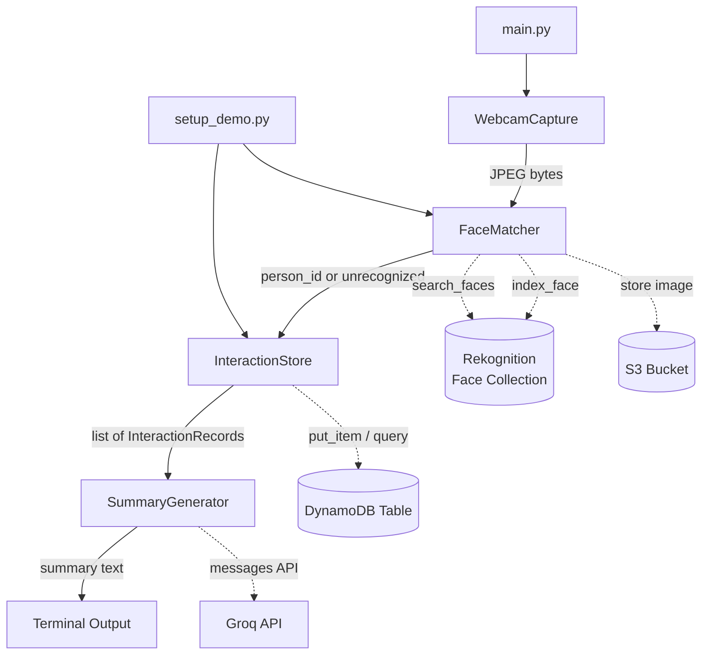

# Design Document

## Overview

The Dementia Face Recognition Assistant is a GUI based Python application that helps dementia patients identify familiar people in real time. When launched, it captures a webcam frame, matches the face against a known collection via Amazon Rekognition, retrieves past interaction history from DynamoDB, generates a warm plain-language summary via Claude Haiku (Anthropic API), and prints the result to the terminal.

The system is intentionally simple: a single `main.py` entry point orchestrates five discrete components in a linear pipeline. There is no persistent UI, no background service, and no user interaction beyond launching the command. A separate `setup_demo.py` script pre-populates the system with demo faces and interactions for demonstration purposes.

Key design goals:
- Minimal cognitive load for the patient — one command, one readable output
- Clear separation of concerns across five components
- All AWS/Anthropic credentials managed via environment variables or AWS credential chain
- Graceful, descriptive error handling at every step

---

## Architecture

The system follows a linear pipeline architecture. Each component has a single responsibility and communicates through simple Python return values and exceptions.



**External dependencies:**
- Amazon Rekognition — face indexing and matching
- Amazon S3 — face image storage
- Amazon DynamoDB — interaction history persistence
- Anthropic API (Claude Haiku) — plain-language summary generation
- OpenCV (`cv2`) — webcam capture and JPEG encoding

---

## Components and Interfaces

### WebcamCapture

Responsible for opening the default webcam and capturing a single JPEG-encoded frame.

```python
class WebcamCapture:
    def capture(self) -> bytes:
        """
        Opens the default webcam, captures one frame, encodes it as JPEG,
        and returns the raw bytes.
        Raises SystemExit with a descriptive message if no device is found
        or capture fails.
        """
```

### FaceMatcher

Wraps Amazon Rekognition for face indexing and searching. Also stores source images in S3.

```python
class FaceMatcher:
    def __init__(
        self,
        collection_id: str,
        bucket_name: str,
        confidence_threshold: float = 80.0,
    ): ...

    def index_face(self, image_bytes: bytes, person_id: str) -> str:
        """
        Indexes a face image into the Rekognition collection.
        Stores the image in S3 keyed by person_id.
        Returns the Rekognition face_id.
        Raises ValueError if no face is detected.
        Raises RuntimeError on API failure.
        """

    def match_face(self, image_bytes: bytes) -> str | None:
        """
        Searches the Rekognition collection for the best match above
        confidence_threshold.
        Returns the person_id string if matched, or None if unrecognized.
        Raises RuntimeError on API failure.
        """
```

### InteractionStore

Wraps DynamoDB for writing and reading interaction records.

```python
@dataclass
class InteractionRecord:
    record_id: str          # UUID
    person_id: str
    description: str
    timestamp: str          # ISO 8601

class InteractionStore:
    def __init__(self, table_name: str): ...

    def add_interaction(self, person_id: str, description: str) -> InteractionRecord:
        """
        Writes a new InteractionRecord to DynamoDB.
        Raises RuntimeError on write failure.
        """

    def get_interactions(self, person_id: str) -> list[InteractionRecord]:
        """
        Returns all InteractionRecords for person_id, sorted by timestamp
        descending (most recent first).
        Returns empty list if none found.
        Raises RuntimeError on query failure.
        """
```

### SummaryGenerator

Wraps the Anthropic API to produce warm, plain-language summaries.

```python
class SummaryGenerator:
    def __init__(self, api_key: str, max_words: int = 150): ...

    def generate(
        self,
        person_id: str,
        interactions: list[InteractionRecord],
    ) -> str:
        """
        Sends a prompt to Claude Haiku requesting a warm, calm, reassuring
        summary of the person and their past interactions.
        Returns the generated summary text (≤ 150 words).
        Raises RuntimeError on API failure.
        """
```

### Terminal Display (inline in main.py)

Simple print-based output. No dedicated class needed.

```python
def display_result(person_id: str | None, summary: str) -> None:
    """
    Prints a blank line, the person name + summary (or unrecognized message),
    then another blank line.
    """
```

### Demo Loader (setup_demo.py)

Standalone script that pre-populates the system with demo data.

```python
def load_demo(face_matcher: FaceMatcher, interaction_store: InteractionStore) -> None:
    """
    Indexes demo face images and writes demo interaction records.
    Skips missing image files with a printed warning.
    Prints a confirmation listing successfully loaded persons.
    """
```

---

## Data Models

### InteractionRecord (DynamoDB schema)

| Attribute     | Type   | Notes                                      |
|---------------|--------|--------------------------------------------|
| `record_id`   | String | Partition key; UUID v4                     |
| `person_id`   | String | GSI partition key for person queries       |
| `description` | String | Human-readable interaction description     |
| `timestamp`   | String | ISO 8601 UTC (e.g. `2024-01-15T10:30:00Z`) |

A Global Secondary Index (GSI) on `person_id` enables efficient queries by person. Results are sorted client-side by `timestamp` descending after retrieval (DynamoDB does not sort on non-key attributes without a sort key on the GSI; alternatively, `timestamp` can be the GSI sort key).

**Recommended GSI design:**
- GSI name: `person_id-timestamp-index`
- Partition key: `person_id`
- Sort key: `timestamp`
- Projection: ALL

This allows DynamoDB to return records sorted by timestamp natively using `ScanIndexForward=False`.

### S3 Object Key Convention

Face images are stored at: `faces/{person_id}.jpg`

### Rekognition Face Collection

- One collection per deployment, identified by `collection_id`
- Each indexed face carries an `ExternalImageId` set to `person_id`
- `SearchFacesByImage` returns matches sorted by similarity; the system takes the first result above `confidence_threshold`

### Environment Variables

| Variable                  | Purpose                              |
|---------------------------|--------------------------------------|
| `AWS_REGION`              | AWS region (default: `us-east-1`)    |
| `REKOGNITION_COLLECTION`  | Rekognition collection ID            |
| `S3_BUCKET`               | S3 bucket name for face images       |
| `DYNAMODB_TABLE`          | DynamoDB table name                  |
| `ANTHROPIC_API_KEY`       | Anthropic API key                    |
| `CONFIDENCE_THRESHOLD`    | Optional override (default: `80`)    |

